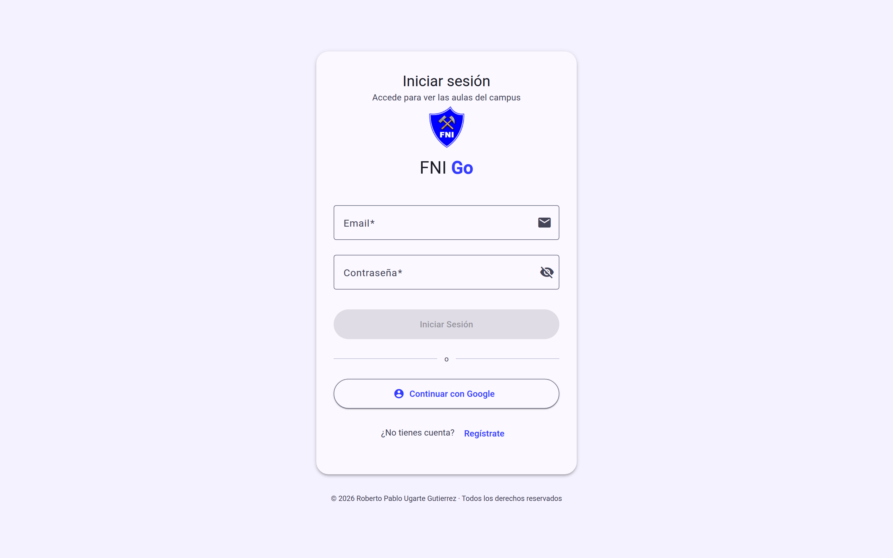
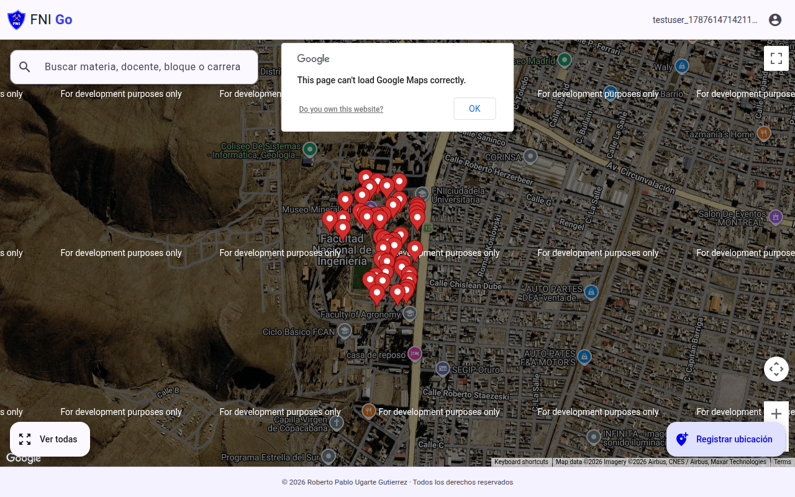
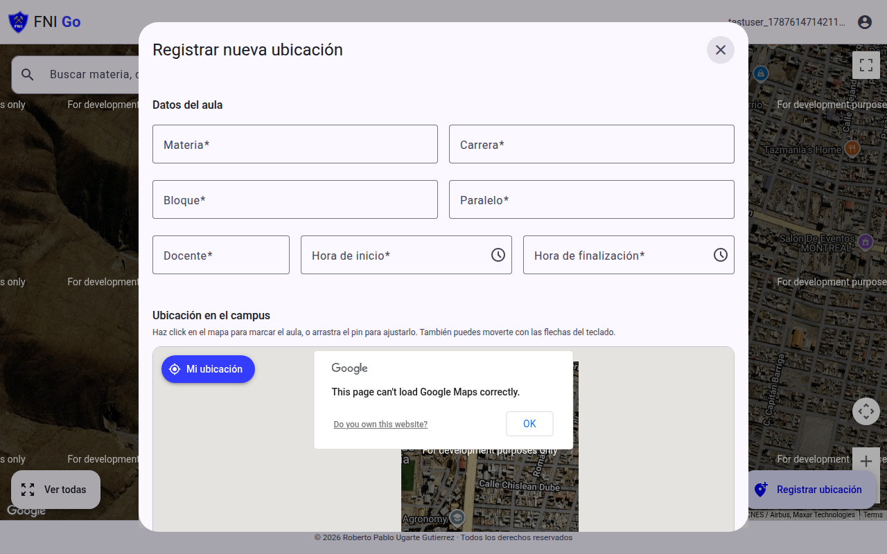
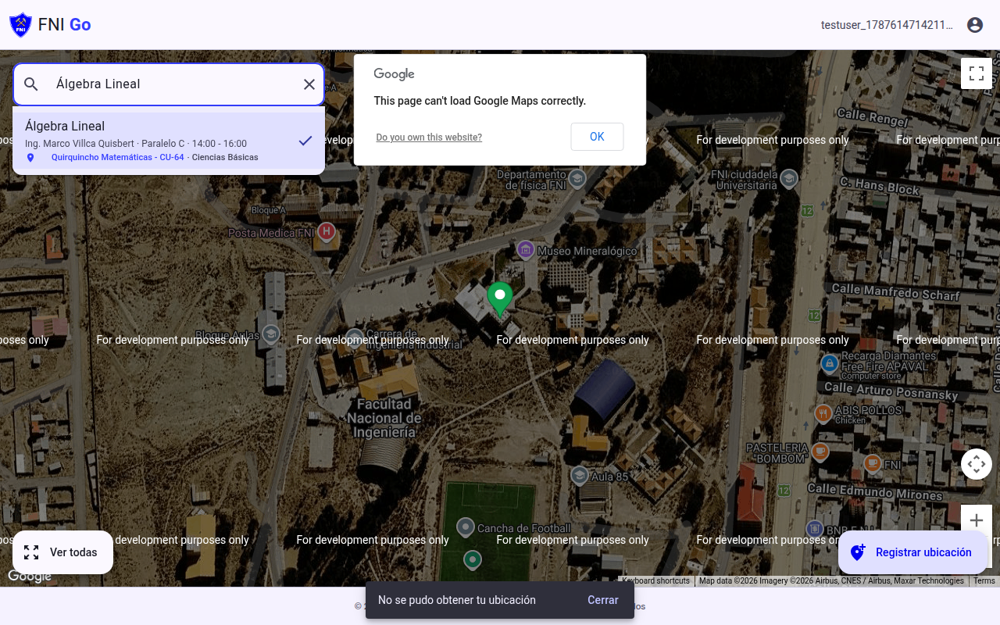
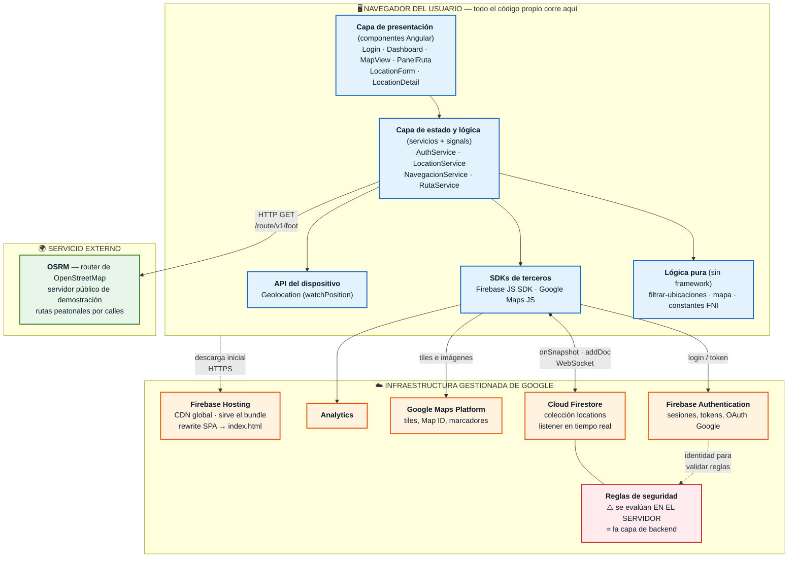

# FNI Go — Aulas del campus

Aplicación web para encontrar en qué aula se dicta una clase dentro de la
Ciudad Universitaria de la Facultad Nacional de Ingeniería (UTO, Oruro), verla
en el mapa del campus y caminar hasta ella siguiendo una ruta trazada sobre
calles reales.

Módulo I · Trabajo Final — Análisis, construcción y publicación.

## Enlaces

- **App en Firebase:** https://fni-2026.web.app
- **Repositorio:** https://github.com/Roberto9292/zFNI-2026
- **Video explicativo:** _(añade aquí el enlace al video)_
- **Autor:** Roberto Pablo Ugarte Gutierrez

## Capturas

> _Pendientes: se toman junto con el video. Basta guardar los cuatro PNG en
> `docs/capturas/` con los nombres que ya esperan los enlaces de abajo._

| Acceso | Mapa del campus |
|---|---|
|  |  |

| Registro de un aula | Ruta a pie en curso |
|---|---|
|  |  |

---

## 1. El problema y a quién afecta

En la FNI el horario oficial dice *qué* materia se dicta, *cuándo* y en qué
aula — pero identifica el aula con un código (`Bloque B, Aula 12`) que solo
sirve si uno ya sabe dónde queda el bloque B. El campus es abierto, con varios
bloques dispersos, sin nomenclatura visible desde fuera y con edificios que se
parecen entre sí. La información de *dónde está* ese código nunca estuvo en un
mapa: vive en la memoria de quienes llevan años ahí.

**A quién afecta, en orden de gravedad:**

- **Estudiantes de primer año y de nuevo ingreso.** Son los más golpeados.
  Llegan con un horario que no pueden traducir a un lugar físico y pierden los
  primeros minutos de clase —o la clase entera— preguntando a desconocidos.
  El costo se concentra justo en las primeras semanas, que es cuando peor
  sienta llegar tarde.
- **Estudiantes que cursan materias de otra carrera o de otro bloque.** Conocen
  su propio edificio, no el resto del campus.
- **Docentes suplentes e invitados**, que reciben una asignación de aula sin
  ninguna referencia geográfica.
- **Visitantes** en defensas de tesis, congresos o exámenes de admisión, que
  van una sola vez y a un lugar que nunca vieron.

El problema no es la falta de datos, sino que el dato existente (*aula*) no
está enlazado a una coordenada. **FNI Go es ese enlace**: convierte un código
de aula en un punto en el mapa y en un camino hasta él.

Un detalle que condicionó el diseño: el uso real ocurre **caminando, al aire
libre, con una mano ocupada y con prisa**. Por eso la aplicación se diseñó
para móvil primero, la búsqueda tolera errores de tipeo y acentos, y la
pantalla principal es el mapa, no un menú.

---

## 2. Alcance

### Qué incluye

| Función | Detalle |
|---|---|
| **Autenticación** | Registro e inicio de sesión con email y contraseña, e inicio de sesión con Google. Sesión persistente entre recargas. |
| **Mapa del campus** | Vista híbrida (satélite + calles) centrada en la Ciudad Universitaria, con estilo propio definido en Google Maps Studio. |
| **Registro de aulas** | Formulario en diálogo: materia, docente, carrera, bloque, paralelo y horario (con validación de que la hora de fin sea posterior a la de inicio). La coordenada se fija haciendo clic en el mapa, arrastrando el marcador o tomando el GPS del dispositivo. |
| **Búsqueda** | Por materia, docente, carrera, bloque, paralelo u horario. Insensible a mayúsculas y acentos: `calculo` encuentra `Cálculo`. Resultados paginados de 5 en 5. |
| **Detalle** | Panel inferior con todos los datos del aula y accesos a la ruta. |
| **Ruta a pie** | Trazado por calles reales con seguimiento del GPS en vivo, distancia, tiempo estimado y recálculo automático al alejarse más de 25 m. |
| **Entrega a Google Maps** | Botón para abrir la navegación paso a paso en la app de Google Maps. |
| **Tiempo real** | Un aula registrada desde un dispositivo aparece en los demás sin recargar (listener de Firestore). |
| **Accesibilidad** | Mapa navegable con teclado (flechas y `+`/`-`), etiquetas ARIA, foco gestionado en diálogos. |
| **Responsive** | Adaptación real a móvil: los controles cambian de forma para no tapar el mapa. |

### Qué NO incluye

Se dejó fuera de forma deliberada, no por olvido:

- **Editar y borrar aulas desde la interfaz.** Las operaciones existen en
  `LocationService` pero no se expusieron: sin roles de usuario, cualquiera
  podría borrar el trabajo de otro. La UI llega cuando existan los permisos.
- **Roles y permisos** (estudiante / docente / administrador). Hoy todo
  usuario autenticado tiene las mismas capacidades.
- **Navegación paso a paso con voz e indicaciones giro a giro.** Se delega en
  Google Maps en lugar de reimplementarla.
- **Rutas dentro de los edificios.** La ruta termina en la puerta; no hay
  planos interiores ni pisos.
- **Importación masiva del horario oficial.** La carga es manual, aula por
  aula. Integrarse con el sistema académico de la UTO excede el trabajo.
- **Funcionamiento sin conexión / PWA.** Requiere internet para mapa y datos.
- **Notificaciones** de "tu clase empieza en 10 minutos".
- **Pruebas automatizadas.** El proyecto no tiene tests; la verificación fue
  manual. Es la deuda técnica más clara.

---

## 3. Arquitectura

No hay servidor propio. La aplicación es una **SPA que se ejecuta entera en el
navegador** y habla directamente con servicios gestionados (BaaS). No existe
código nuestro corriendo en un servidor: lo que sería la capa de backend son
las **reglas de seguridad de Firestore**, que Google evalúa del lado del
servidor en cada lectura y escritura.



### Dónde se ejecuta cada pieza

| Pieza | Dónde se ejecuta | Responsabilidad |
|---|---|---|
| Componentes Angular | Navegador | Pintar y capturar interacción. Nada más: no deciden lógica de negocio. |
| `AuthService` | Navegador | Envuelve Firebase Auth y expone la sesión como signal. Su bandera `isReady` evita el falso negativo del arranque, cuando "sin usuario" todavía significa "aún no sé". |
| `LocationService` | Navegador | Listener en vivo de Firestore. Se ata a la **sesión**, no al ciclo de vida de un componente: al cerrar sesión las reglas cortan el listener y al volver a entrar hay que reabrirlo, o el mapa queda vacío. |
| `NavegacionService` | Navegador | Sigue el GPS y decide cuándo vale la pena pedir una ruta nueva (umbral de 25 m, para que el temblor del GPS no dispare peticiones). |
| `RutaService` | Navegador | Traduce entre el formato de OSRM (`lng,lat`) y el de Google (`lat,lng`). |
| `filtrar-ubicaciones.ts` | Navegador | Función **pura**, fuera del componente: se puede probar sin montar un mapa ni Angular. |
| Bundle estático | Firebase Hosting (CDN de Google) | Entrega de HTML/JS/CSS. Los assets con hash se cachean un año; el `index.html`, nunca. |
| Reglas de Firestore | Servidores de Google | **La única validación no eludible.** Todo lo que valide el navegador es sugerencia; esto es la puerta. |
| Cálculo de rutas | Servidor público de OSRM | Geometría del camino a pie. |
| Tiles del mapa | Google Maps Platform | Imágenes del campus y estilo. |

### Flujo completo de una consulta

1. El usuario entra a `fni-2026.web.app` → Hosting entrega el bundle.
2. Firebase Auth restituye la sesión guardada; hasta que responde, la app no
   decide nada (`isReady`).
3. Con sesión activa, `LocationService` abre el listener de `locations` y las
   aulas llegan por WebSocket.
4. El usuario escribe `fisica`; `filtrarUbicaciones` normaliza acentos y filtra
   en memoria — sin ida y vuelta a la red, porque el conjunto es pequeño.
5. Al elegir un resultado se abre el detalle y, con "Cómo llegar",
   `NavegacionService` arranca `watchPosition`.
6. Cada lectura del GPS que se aleje más de 25 m del último punto calculado
   pide una ruta a OSRM; el trazado se dibuja como polilínea sobre el mapa.
7. Si OSRM falla, se dibuja la línea recta y se marca la distancia como
   **aproximada** — la app nunca se queda muda.

---

## 4. Justificación de cada tecnología

### Resumen

| Tecnología | Por qué se eligió | Alternativa descartada | Motivo del descarte |
|---|---|---|---|
| **Angular 19** | Router, formularios, HTTP e inyección en la caja; signals + `OnPush` para repintar solo lo que cambia | React | Obligaría a elegir y unir router, formularios, HTTP y estado por separado: más decisiones y más riesgo con un solo autor |
| **Angular Material** | `bottom-sheet`, `autocomplete`, `timepicker` y diálogos ya accesibles y con foco resuelto | Tailwind CSS / Bootstrap | Tailwind solo da estilos: habría que construir esos componentes y su accesibilidad desde cero. Bootstrap es visualmente de escritorio y esto se usa con el pulgar |
| **Cloud Firestore** | Tiempo real con `onSnapshot` sin código de sincronización; modelo documental que encaja con aulas sin relaciones | Realtime Database / PostgreSQL | RTDB complica consultar y ordenar sobre su árbol único. PostgreSQL exigiría servidor propio, API REST y WebSockets a mano para guardar seis campos |
| **Firebase Auth** | Hash, refresco de token, sesión persistente y OAuth con Google resueltos; la identidad llega verificada a las reglas | Autenticación propia con JWT | Servidor, base de usuarios, política de contraseñas y rotación de tokens: donde aparecen los agujeros más caros |
| **Firebase Hosting** | Requisito de la consigna; CDN, HTTPS, rewrite de SPA y un solo despliegue para app y reglas | Cloud Run / Vercel / Netlify | Cloud Run es para contenedores y aquí no hay servidor. Vercel/Netlify partirían el stack en dos proveedores |
| **Google Maps Platform** | La capa satelital permite reconocer los edificios a ojo, que es como se orienta quien está parado en el campus | Leaflet + OpenStreetMap | La FNI está incompleta en OSM y su imagen satelital de Oruro no da el detalle necesario. Aquí el mapa **es** el producto |
| **OSRM** | Router de OpenStreetMap con servidor público: rutas por calles sin clave ni tarjeta | Directions API de Google | **Exige facturación activa**, justo lo que este proyecto no tiene. Extraer rutas de google.com/maps lo prohíben sus términos |
| **Signals** | El estado son unos pocos valores leídos desde plantillas; `computed` deriva resultados sin suscripciones que cerrar | NgRx | Acciones, reducers, efectos y selectores rinden con estados entrelazados; aquí solo añadirían archivos |
| **Bun** | Instalación mucho más rápida, compatible con npm | npm | Ninguno de peso: sigue funcionando igual. `bun.lock` está en el repo |
| **Sin backend propio** | Cero infraestructura que mantener y desarrollo más rápido | Servidor propio / Cloud Functions | Innecesario para el alcance. Si aparecen roles, la respuesta serían Functions, no un servidor |

### El detalle de cada decisión


### Angular 19 (standalone + signals) — en lugar de React

**Por qué Angular.** El proyecto necesitaba formularios con validación real
(rango horario, coordenadas, longitudes mínimas), enrutado, inyección de
dependencias y HTTP. Angular trae las cuatro cosas en la caja y con una sola
convención. Los *signals* de la versión 19 permitieron modelar todo el estado
—sesión, aulas, ruta, búsqueda— como valores reactivos sin gestor externo, y
`ChangeDetectionStrategy.OnPush` en todos los componentes hace que solo se
repinte lo que cambió, algo que importa cuando el GPS emite cada dos segundos
sobre un mapa.

**Alternativa descartada: React.** Es más liviano de inicio, pero habría
exigido elegir y unir por separado router, formularios, cliente HTTP y gestor
de estado. Ese pegamento es decisión propia, sin convención que la respalde, y
en un proyecto con un solo autor y plazo cerrado añade riesgo sin devolver
nada. Angular impone una estructura que aquí es una ventaja, no un peso.

### Angular Material — en lugar de Tailwind CSS o Bootstrap

**Por qué Material.** Los componentes difíciles ya vienen resueltos y
accesibles: `mat-bottom-sheet` (el panel de detalle), `mat-autocomplete` (la
búsqueda), `mat-timepicker`, diálogos con foco atrapado y devuelto. Recrear el
manejo de foco y las etiquetas ARIA a mano habría llevado más tiempo que el
resto de la interfaz junta.

**Alternativa descartada: Tailwind.** Da control visual total, pero solo
entrega estilos: cada diálogo, panel y autocompletado habría que construirlo y
hacerlo accesible desde cero. **Bootstrap** se descartó porque su lenguaje
visual es de escritorio y esta aplicación se usa con el pulgar, caminando.

### Cloud Firestore — en lugar de Realtime Database o PostgreSQL

**Por qué Firestore.** El tiempo real es gratis: `onSnapshot` mantiene la lista
de aulas viva en todos los dispositivos sin escribir una línea de
sincronización. Los datos son documentos independientes y sin relaciones, que
es justo su modelo. Además el SDK habla directo desde el navegador, así que no
hace falta API intermedia.

**Alternativa descartada: Realtime Database.** También es en vivo, pero su
modelo de árbol JSON único complica consultar y ordenar, y sus reglas son
menos expresivas para lo que hará falta al añadir roles. **PostgreSQL** se
descartó por consecuencia directa: obligaría a levantar y mantener un servidor
propio, escribir una API REST y resolver el tiempo real a mano con WebSockets
— todo para guardar seis campos por aula.

### Firebase Authentication — en lugar de autenticación propia con JWT

**Por qué Firebase Auth.** Resuelve lo que es fácil hacer mal: hash de
contraseñas, refresco de tokens, persistencia de sesión y OAuth con Google. Y
se integra con las reglas de Firestore, que reciben la identidad ya verificada
sin código nuestro de por medio.

**Alternativa descartada: JWT propio.** Habría significado un servidor, una
base de usuarios, política de contraseñas y rotación de tokens. Escribir
autenticación a mano es donde aparecen los agujeros más caros, y no había
ningún requisito que Firebase Auth no cubriera.

### Firebase Hosting — en lugar de Vercel, Netlify o Cloud Run

**Por qué Hosting.** Es requisito de la consigna, pero además encaja: CDN
global, HTTPS automático, `rewrite` de todas las rutas a `index.html` (que es
lo que necesita una SPA) y un solo despliegue para hosting y reglas de base de
datos. Los encabezados de caché están afinados a mano: los archivos con hash
en el nombre se cachean un año e `index.html` nunca, para que un despliegue se
vea al instante sin dejar el resto sin caché.

**Alternativa descartada: Cloud Run.** Es para contenedores con servidor; aquí
no hay servidor que contener y saldría más caro y más lento en frío.
**Vercel/Netlify** habrían separado el hosting del resto del stack, obligando
a manejar dos proveedores y dos despliegues para una sola aplicación.

### Google Maps Platform — en lugar de Leaflet + OpenStreetMap

**Por qué Google Maps.** La FNI no está bien mapeada en OpenStreetMap: los
bloques del campus aparecen incompletos. La capa satelital de Google permite
reconocer edificios a ojo, que es exactamente cómo se orienta alguien parado
en el campus. `@angular/google-maps` envuelve el SDK en componentes Angular, y
los *advanced markers* con `PinElement` permiten colorear el aula destacada.

**Alternativa descartada: Leaflet + OSM.** Es libre y sin cuota, pero su
imagen satelital es de menor resolución en Oruro y el detalle de los edificios
del campus no alcanza para reconocerlos. Aquí el mapa **es** el producto, así
que la calidad de imagen pesó más que el ahorro.

### OSRM para el trazado de rutas — en lugar de la Directions API de Google

**Por qué OSRM.** Es el router de OpenStreetMap y su servidor público de
demostración responde sin clave ni tarjeta. Devuelve la geometría del camino,
que es lo único que la aplicación necesita para dibujar la polilínea.

**Alternativa descartada: Directions API de Google.** Habría sido lo natural
—ya usamos Maps— pero **exige facturación activa**, que es precisamente lo que
este proyecto no tiene. Se descartó también extraer rutas de `google.com/maps`
para redibujarlas: lo prohíben sus términos de uso.

**Lo que esto cuesta, dicho claro:** el servidor público de OSRM no ofrece
garantía de disponibilidad y, aunque se le pida perfil `foot`, enruta con
perfil de coche — su duración no sirve, así que el tiempo a pie se calcula
aquí a 5 km/h. Y cuando OSRM no responde, la app cae a línea recta y **marca
esa distancia como aproximada** en lugar de mentir. Para producción real
tocaría hospedar un OSRM propio o pagar Directions.

### Signals — en lugar de RxJS o NgRx

**Por qué signals.** El estado de esta aplicación es un puñado de valores que
se leen desde plantillas. Los signals lo expresan directamente y los
`computed` derivan resultados de búsqueda y marcadores sin suscripciones que
haya que recordar cerrar.

**Alternativa descartada: NgRx.** Su ceremonia (acciones, reducers, efectos,
selectores) rinde en aplicaciones con muchos estados entrelazados; aquí solo
añadiría archivos. **RxJS** no se abandonó del todo —se usa donde encaja
mejor, como `toSignal` sobre `valueChanges` del buscador y `firstValueFrom`
para la llamada HTTP.

### Bun como gestor de paquetes — en lugar de npm

**Por qué Bun.** Instala mucho más rápido y es compatible con el ecosistema de
npm. El proyecto incluye `bun.lock`.

**Alternativa: npm.** Sigue funcionando sin cambios; si no se tiene Bun, todos
los comandos son equivalentes con `npm`.

### Decisión transversal: sin backend propio

Toda la arquitectura descansa en que **no hay servidor nuestro**. Se ganó
velocidad de desarrollo y cero mantenimiento de infraestructura. Se pagó con
dos límites reales: la lógica de negocio no puede esconderse del cliente, y
toda la seguridad depende de las reglas de Firestore. Es un intercambio
razonable para el alcance actual; si aparecieran roles o integración con el
sistema académico, la respuesta sería Cloud Functions, no un servidor propio.

---

## 5. Cómo ejecutar el proyecto

### Requisitos

- **Node.js 20 o superior** (desarrollado con v24.12.0)
- **Bun** (opcional; sustituible por npm)
- Cuenta de Firebase con acceso al proyecto `fni-2026`, solo para desplegar

### Instalación y ejecución local

```bash
git clone git@github.com:Roberto9292/zFNI-2026.git
cd zFNI-2026

bun install          # o: npm install
bun start            # o: npm start
```

La aplicación queda en **http://localhost:4200**. Recarga sola al guardar
cambios.

### Compilar para producción

```bash
bun run build        # o: npm run build
```

Genera el bundle optimizado en `dist/browser/`.

### Desplegar en Firebase

```bash
npx firebase login
npx firebase deploy --only hosting                 # solo la aplicación
npx firebase deploy --only firestore:rules         # solo las reglas
npx firebase deploy                                # todo
```

> La ruta `public` de `firebase.json` es `dist/browser`, que es donde Angular 19
> deja la salida. Hay que compilar **antes** de desplegar.

### Configuración

Las claves de Firebase y de Google Maps están en el código
(`src/app/app.config.ts` y `src/index.html`). **Esto es correcto y no es una
fuga**: en una aplicación de navegador esas claves se entregan al cliente por
definición, viajen donde viajen. Lo que las protege no es esconderlas, sino
las **reglas de Firestore** y la **restricción por dominio** de la clave de
Maps en Google Cloud Console.

Para apuntar a otro proyecto de Firebase: cambiar el bloque `initializeApp` de
`src/app/app.config.ts`, la clave del `<script>` de `src/index.html` y el
`default` de `.firebaserc`.

### Estructura del proyecto

La organización sigue una regla: **`core/` no sabe que existe `components/`.**
La lógica no depende de la interfaz, así que se puede probar y reutilizar sin
montar Angular.

```
src/
├─ index.html                      # carga el SDK de Google Maps y las fuentes
├─ main.ts                         # arranque de la aplicación
├─ styles.scss                     # estilos globales
├─ styles/
│  └─ _theme-colors.scss           # paleta del tema Material (Material 3)
└─ app/
   ├─ app.component.ts|html        # shell: decide entre login y dashboard
   ├─ app.config.ts                # providers: Firebase, router, HttpClient
   ├─ app.routes.ts                # rutas con carga diferida
   │
   ├─ core/                        # lógica, sin interfaz — no importa nada de components/
   │  ├─ models/
   │  │  ├─ location.interface.ts  # el aula: materia, docente, coordenadas…
   │  │  └─ user.interface.ts      # usuario ya normalizado
   │  ├─ services/
   │  │  ├─ auth.service.ts        # sesión (Firebase Auth) como signal
   │  │  ├─ location.service.ts    # CRUD + listener en vivo de Firestore
   │  │  ├─ navegacion.service.ts  # seguimiento GPS y recálculo de ruta
   │  │  └─ ruta.service.ts        # cliente de OSRM
   │  ├─ busqueda/
   │  │  └─ filtrar-ubicaciones.ts # función pura: filtra sin acentos ni mayúsculas
   │  ├─ maps/
   │  │  └─ mapa.ts                # opciones y pines, en un solo sitio
   │  └─ constants/
   │     └─ fni.ts                 # centro y zoom del campus
   │
   ├─ components/                  # una carpeta por pantalla o panel
   │  ├─ login/                    # acceso y registro
   │  ├─ dashboard/                # barra, mapa y botón de registro
   │  ├─ map-view/                 # mapa, búsqueda y marcadores
   │  ├─ location-form/            # alta de aula (se abre en diálogo)
   │  ├─ location-detail/          # ficha del aula (panel inferior)
   │  └─ panel-ruta/               # distancia, tiempo y acciones de la ruta
   │
   └─ shared/
      └─ directives/
         └─ mapa-teclado.directive.ts  # mover y acercar el mapa con el teclado
```

**Configuración en la raíz**

| Archivo | Para qué |
|---|---|
| `firebase.json` | Hosting (`public: dist/browser`), rewrite de SPA y caché |
| `.firebaserc` | Proyecto de Firebase por defecto (`fni-2026`) |
| `firestore.rules` | Reglas de seguridad — la única validación no eludible |
| `firestore.indexes.json` | Índices compuestos de Firestore |
| `angular.json` | Configuración de compilación |
| `PENDIENTES.md` | Backlog priorizado por riesgo |

---

## 6. Herramientas y código de terceros

### Dependencias de la aplicación

| Paquete | Versión | Para qué |
|---|---|---|
| `@angular/core`, `common`, `forms`, `router` | 19.2 | Framework base |
| `@angular/material`, `@angular/cdk` | 19.2.17 | Componentes de interfaz |
| `@angular/fire` | 19.2.0 | Integración oficial de Firebase con Angular |
| `@angular/google-maps` | 19.2.17 | Envoltorio oficial del SDK de Google Maps |
| `@types/google.maps` | 3.65.5 | Tipos de TypeScript para Maps |
| `rxjs` | 7.8 | Flujos reactivos puntuales |
| `zone.js` | 0.15 | Detección de cambios de Angular |

### Herramientas de desarrollo

| Herramienta | Versión | Para qué |
|---|---|---|
| Angular CLI | 19.2.13 | Andamiaje, servidor de desarrollo y compilación |
| TypeScript | 5.7.2 | Lenguaje |
| Bun | 1.3.5 | Gestor de paquetes |
| firebase-tools | 15.28.1 | Despliegue |
| Karma + Jasmine | — | Configurados por el CLI; **sin tests escritos** |

### Servicios gestionados (backend delegado)

Todo el proyecto corre en el **plan gratuito Spark** de Firebase; no hay
facturación activa en ninguna cuenta.

| Servicio | Uso | Coste |
|---|---|---|
| **Firebase Hosting** | Publicación de la aplicación | Gratuito (Spark) |
| **Firebase Authentication** | Email/contraseña y OAuth con Google | Gratuito |
| **Cloud Firestore** | Base de datos y tiempo real | Gratuito |
| **Firebase Analytics** | Métricas de uso | Gratuito |

### APIs y recursos externos consumidos

| Recurso | Endpoint / identificador | Licencia o condiciones |
|---|---|---|
| **OSRM** — rutas a pie | `https://router.project-osrm.org/route/v1/foot/{lng},{lat};{lng},{lat}?overview=full&geometries=geojson` | Servidor público de demostración, sin garantía de servicio |
| **Google Maps JavaScript API** | `https://maps.googleapis.com/maps/api/js?libraries=marker` | Cuota gratuita mensual; sujeta a los términos de Google Maps Platform |
| **Map ID (Maps Studio)** | `fb8757a3bfd70c7f9dcba22a` | Estilo propio del mapa |
| **Nominatim** (OpenStreetMap) | Geocodificación del centro del campus, una sola vez en desarrollo | ODbL; el resultado quedó fijado en `core/constants/fni.ts` |
| **Google Fonts** | Roboto y Material Icons | Open Font License |

Los datos de las aulas **no vienen de ninguna API externa**: los introducen los
propios usuarios y se guardan en la colección `locations` de Firestore.

---

© 2026 Roberto Pablo Ugarte Gutierrez
